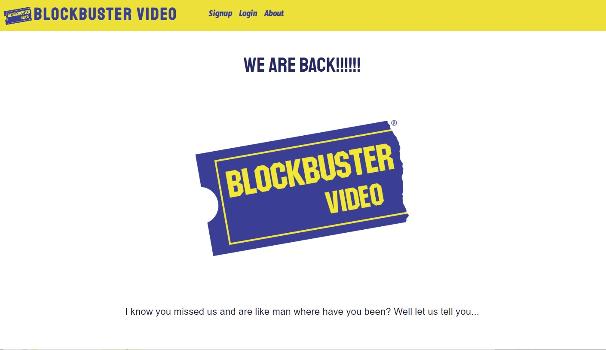
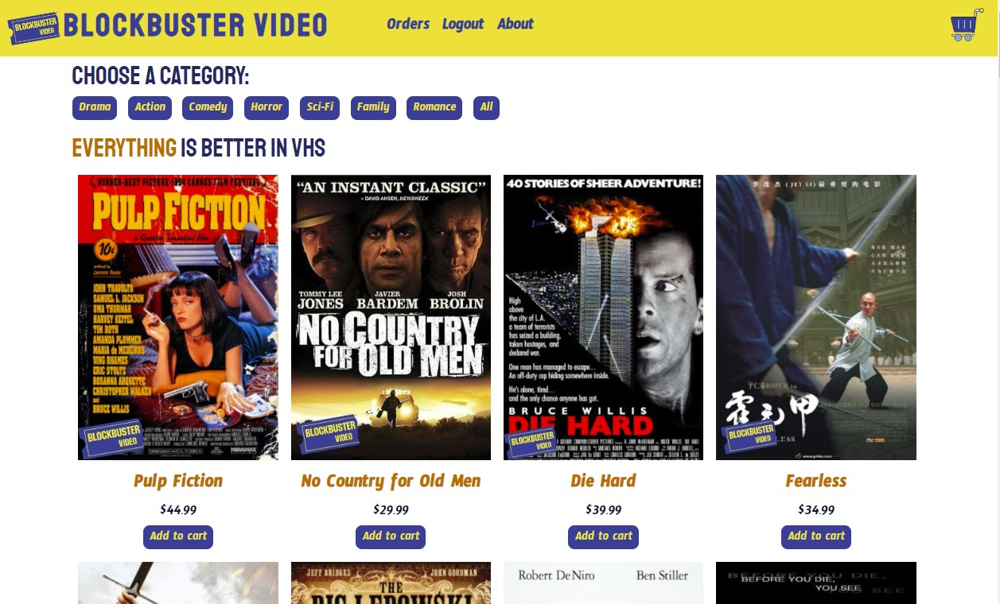
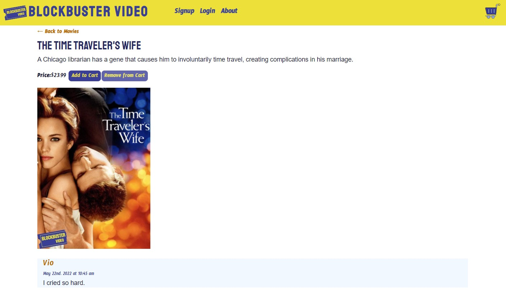
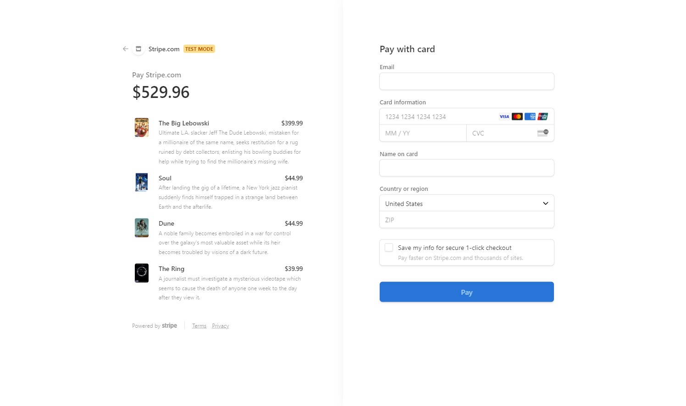
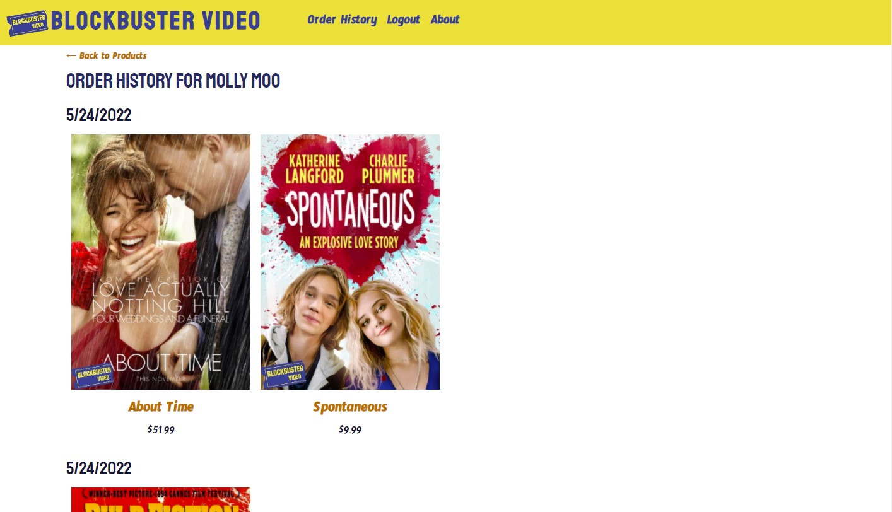

<h1 align= "center">Blockbuster Video</h1>

## Deployed Page

<h3><a href= "https://tranquil-caverns-31701.herokuapp.com/">Blockbuster Video Page</a></h3>

## Table of Contents

- [Description](#description)
- [Technology Stack](#technology-stack)
- [Usage](#usage)
- [Screenshots](#screenshots)
- [Contact](#contact)

## Description

This is our final project for the UofU Web Development Boot Camp. Here we have created fully functional progressive web application built using the MERN stack (MongoDB, Express.js, React, Node.js). GraphQL is used for the query language. Authentication is performed with JSON Web Token.

## Technology Stack

- MongoDB / Mongoose
- Express.js
- GraphQl
- React
- Node.js
- JWT Authentication
- Create-React-App service worker
- JavaScript
- Heroku
- Git

## Usage

Blockbuster Video is back!!! Well not really... But here we made a silly little site of what it would look like if they decided to come back and get into making designer VHS videos. Our goal was to make a engaging and functional store so customers can purchase movies. Also we gave customers the ability to comment on all of the movies in the store. Click on the link in the "Deployed Page" section above to view the site in action. While there you can checkout using the stripe test credit card number `4242 4242 4242 4242`

## Screenshots

### Blockbuster Video About Page

### Blockbuster Video Store Page

### Blockbuster Video Checkout Page

### Blockbuster Video Order History Page

### Contact

<h4><a href= "https://github.com/khklee">Hyunkyoung Kelly Lee</a></h4>

<h5><a href= "https://khklee.github.io/HK-portfolio/">Portfolio</a></h5>  
<h5><a href= "mailto:amorfati38@gmail.com">E-Mail</a></h5>       
<h5><a href= "https://www.linkedin.com/in/khklee/">LinkedIn</a></h5>

<h4><a href= "https://github.com/JohnKnee3">John Clark</a></h4>
 
<h5><a href= "https://johnknee3.github.io/React-Portfolio/">Portfolio</a></h5>  
<h5><a href= "mailto:john.a.clark3@gmail.com">E-Mail</a></h5>       
<h5><a href= "https://www.linkedin.com/in/john-clark-216530225/">LinkedIn</a></h5>

